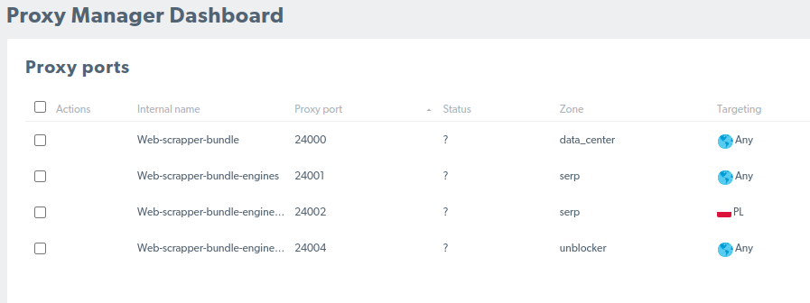
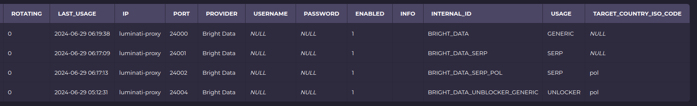

<h1>Proxy Provider</h1>

This project is a part of: <b><a href="">Voltigo</a></b>

## Description

This project provides, and stores the proxy configurations, as well as it saves the calls that were made with given proxies.
There is no gui, so the only way to handle proxy entries is via DB - reason is that the project serves as API only.

Proxy handling was fully tested with <b><a href="https://get.brightdata.com/mwjfqnunf35j">BrightData proxy</a></b>, You can find more
about it <b><a href="https://get.brightdata.com/mwjfqnunf35j">here</a></b>. Keep in mind that there is even a class prepared to handle
their services explicitly: `BrightDataService.php`

## Running the project

- go inside the `docker` directory,
- call `docker-compose -f docker-compose-prod.yaml up -d`
- the project is now reachable:
    - locally under: `127.0.0.1:8202`
    - within other voltigo-related containers under: `host.docker.internal:8202`

## BrightData ProxyManager - simple config

The proxy manager is a part of <b>JobSearcher</b> project. In case of deciding to use it, configuration is as simple as that:

#### In ProxyManager set this:

<i>Internal name does not matter, target country is up to you</i>

#### In database (table = proxy) set this

<i>Internal id should not matter, the target country is up to You (3-digit iso code)</i>

